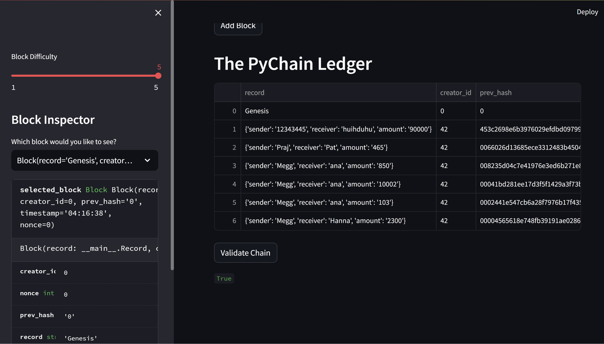

# PyChain Ledger

## Overview:
PyChain Ledger is a simple blockchain implementation built using Python and Streamlit. It allows users to store transaction records in blocks and validate the integrity of the blockchain.

`PyChain.py`: Contains the Python code for the PyChain Ledger

## Usage:
* Launch the application by executing the command `streamlit run PyChain.py`.

* Enter sender, receiver, and amount for a transaction.
Click "Add Block" to add the transaction to the blockchain.

* View the PyChain Ledger and block details.

* Adjust block difficulty using the slider in the sidebar.

* Select specific blocks for inspection in the Block Inspector.

* PyChain Ledger App Screenshot

## Notes:
* Ensure that the sender and receiver addresses are valid inputs.

* The blockchain validation process can be initiated by clicking the "Validate Chain" button.